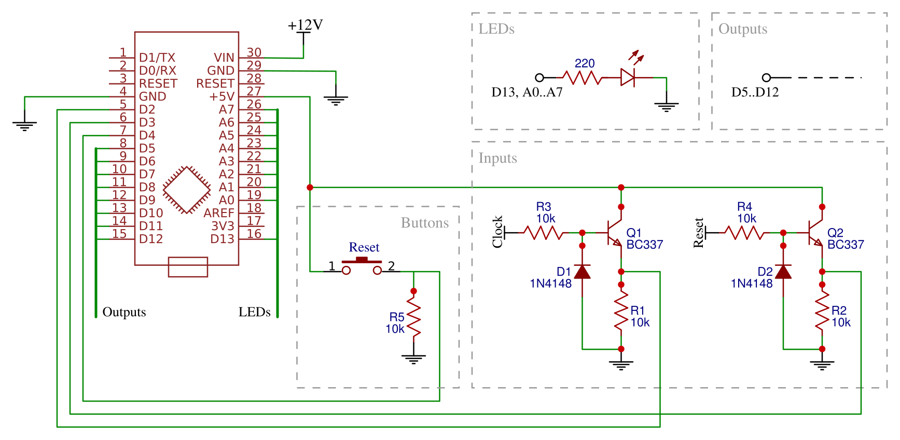
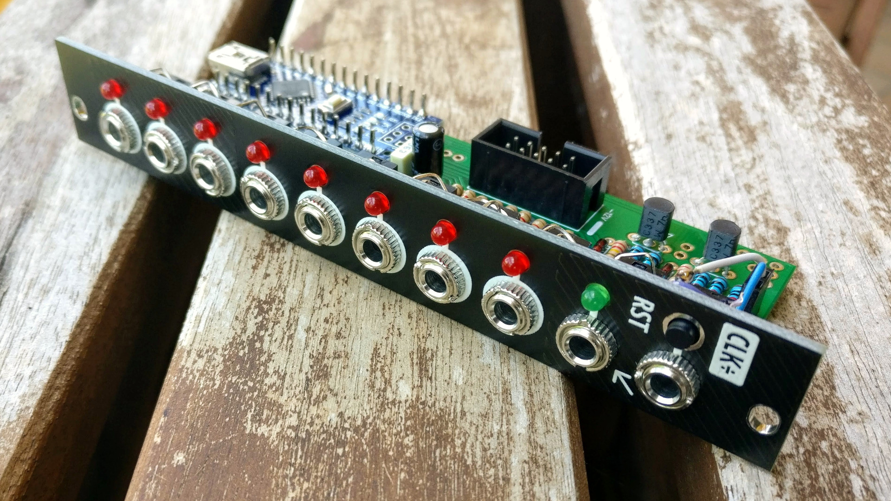
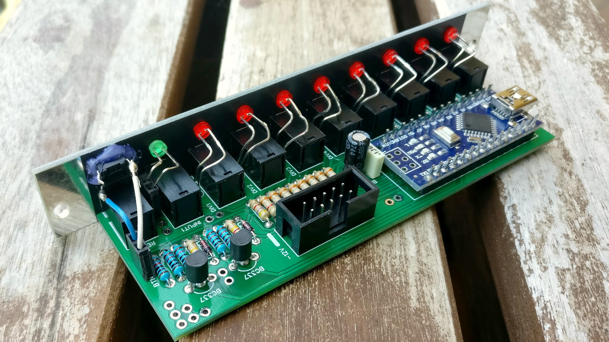
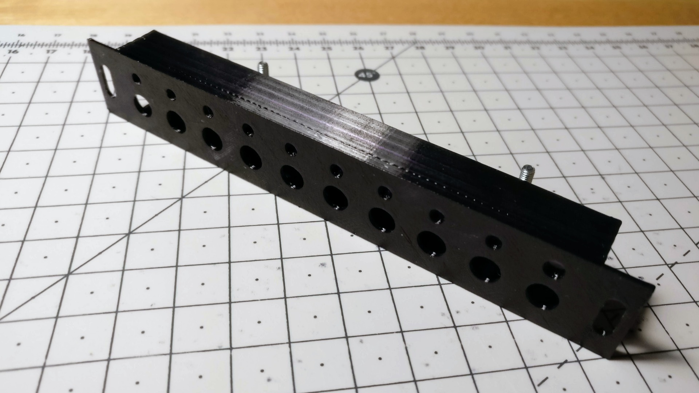
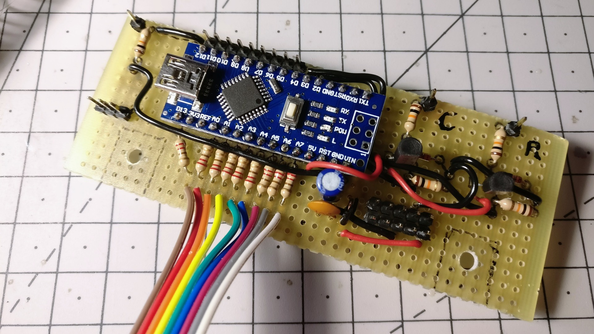
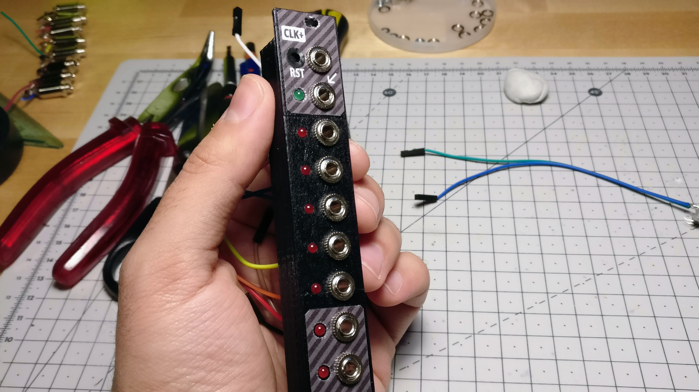
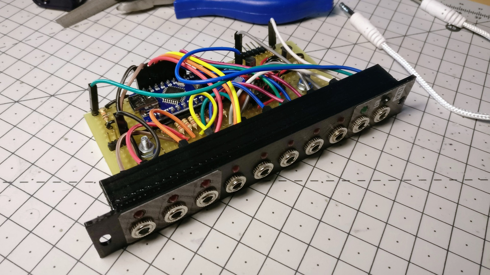

Clock divider
=============

A DIY Arduino-powered clock divider in 4 HP.

**[Arduino code][1]** | **[BOM][5]** | **[ModularGrid][2]** | [🛒 **Buy PCB and panel on Tindie**][3] | [🗨️ **Mod Wiggler**][4]

[1]: clock-divider.ino
[5]: clock-divider-bom.csv
[2]: https://www.modulargrid.net/e/joeseggiola-clock-divider
[3]: https://www.tindie.com/products/joeseggiola/clock-divider-for-eurorack-pcb-panel/
[4]: https://modwiggler.com/forum/viewtopic.php?t=214669

Features
--------

- Divides incoming clock signal by 2, 3, 4, 5, 6, 8, 16, 32 (configurable in code).
- Reset as trigger or manual button.
- Down-beat counting.
- Trigger mode: duration of incoming pulses is preserved on outputs.
- Gate-mode: duration of the output pulses is 50% of divided tempo, enabled by long-pressing the manual reset button.
- Euclidean mode: outputs provide 8 channels of Euclidean rhythms (can be activated in code, implemented by [Tim Richardson](https://github.com/timini/arduino-eurorack-projects/tree/master/clock-divider-euclid-mod)).

Schematic
---------

Pictures
--------

### New [PCB](pcb/) build

[🛒 **Buy PCB and panel on Tindie**][3]

  

### Old [3D-printed](3d/) build

   
