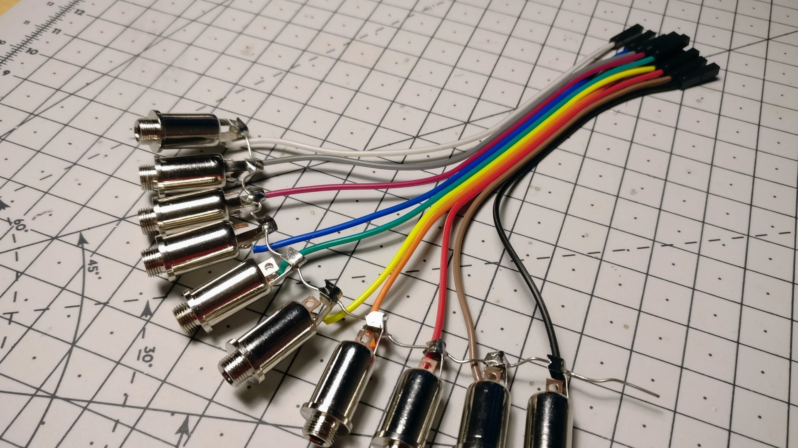
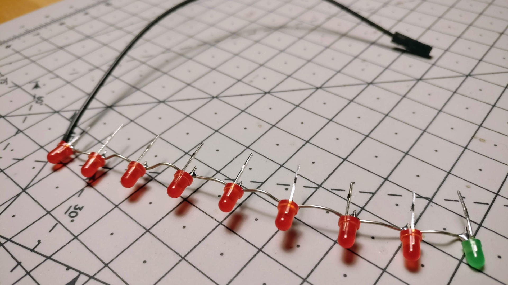

Clock divider
=============

A DIY Arduino-powered clock divider in 4HP, with 3D-printed faceplate.

**[Arduino code][1]** | **[3D model][2]** | **[Plate design][3]** | **[Muff Wiggler][4]** | **[Reddit][5]**

[1]: clock-divider.ino
[2]: plate.stl
[3]: plate.svg
[4]: https://www.muffwiggler.com/forum/viewtopic.php?t=214669
[5]: https://www.reddit.com/r/synthdiy/comments/az5yrv/3dprinted_arduinopowered_eurorack_clock_divider/

Features
--------

- Divides incoming clock signal by 2, 3, 4, 5, 6, 8, 16, 32 (configurable in code).
- Reset as trigger or manual button.
- Down-beat counting.
- Trigger mode: duration of incoming pulses is preserved on outputs.
- Gate-mode: duration of the output pulses is 50% of divided tempo, enabled by long-pressing the manual reset button.

Circuit
--------

The following is just a hint for a possible circuit implementation.

Pictures
--------

     