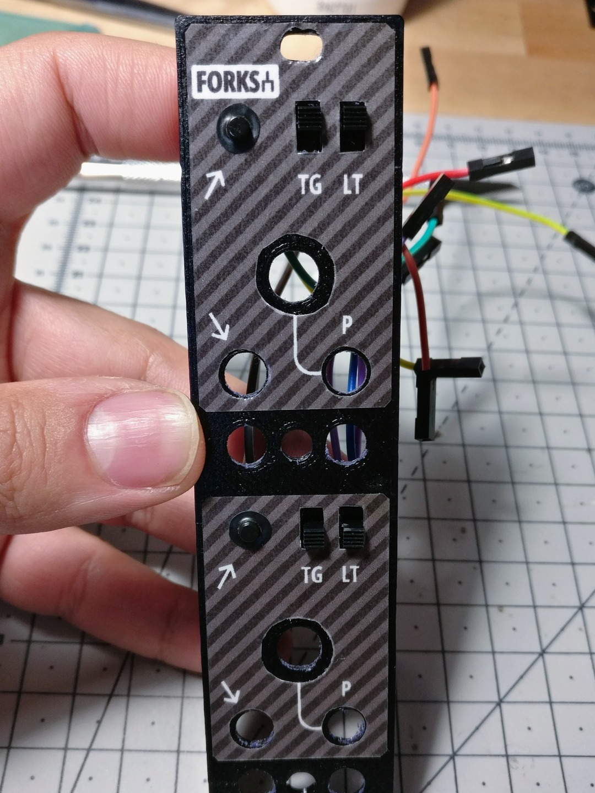
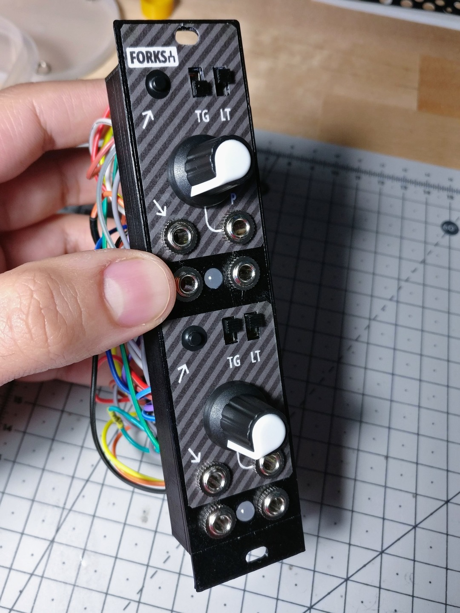

Forks
=====

A DIY Arduino-powered clone of Mutable Instruments [Branches][5], with a 3D-printed faceplate.

**[Arduino code][1]** | **[3D model][2]** | **[Plate design][3]** | **[Muff Wiggler][4]**

[1]: forks.ino
[2]: plate.stl
[3]: plate.svg
[4]: https://www.muffwiggler.com/forum/viewtopic.php?t=216665
[5]: https://mutable-instruments.net/modules/branches/

Features and limitations
------------------------

- Two Bernoulli gates similar to the ones found in Mutable Instruments Branches.
- Both Latch and Toggle modes are enabled with two independent dedicated switches.
- Manual input button, it can be used as a manual trigger/gate generator.

Compared to [Branches][6], it has some drawbacks due to Arduino usage with minimal circuitry around:

- Probability CV input range is unipolar: a negative input will be treated as 0%, and an input higher than 5V as 100%.
- Probability CV input is simply summed to the value of the knob: with the knob fully counter-clockwise the probability is given by the CV input only, turning the knob clockwise will "push" the probability toward 100%, up to fully clockwise where the CV input doesn't matter any more.
- The second channel input is not normalized to the first one.

Circuit
-------

The following is a hint for a possible circuit implementation. Only one Bernoulli gate is laid out, the second is an exact copy.

Pictures
--------

   