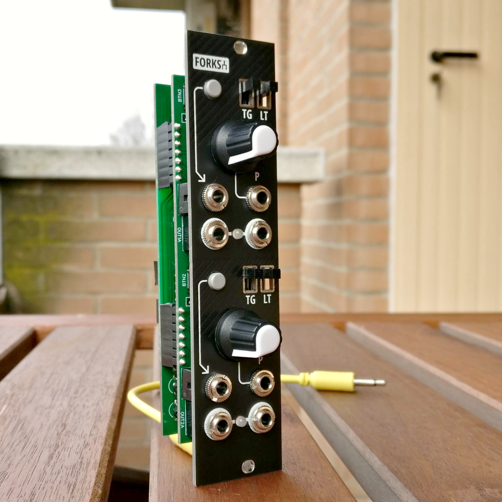
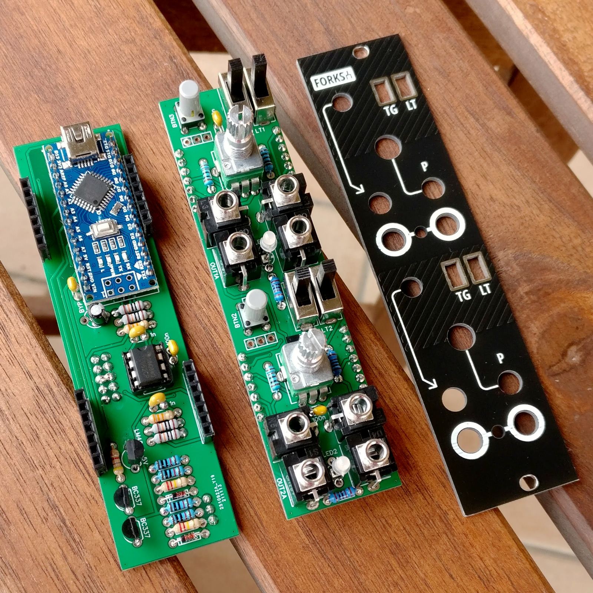
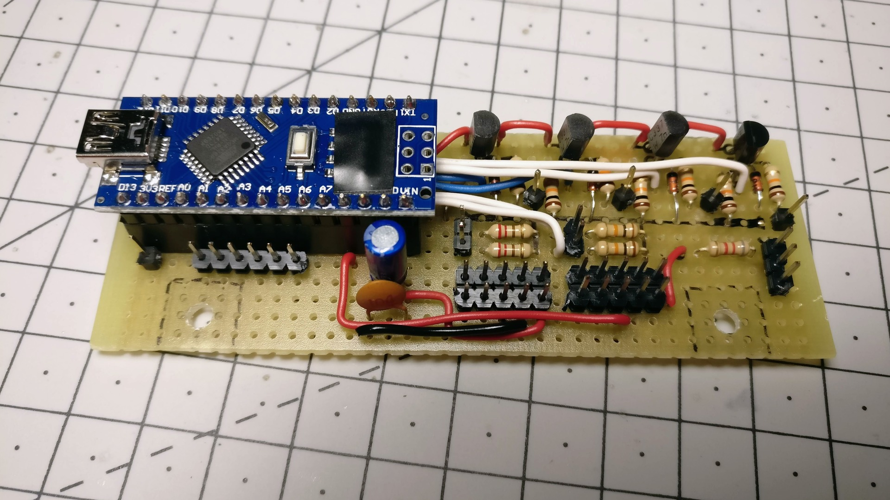
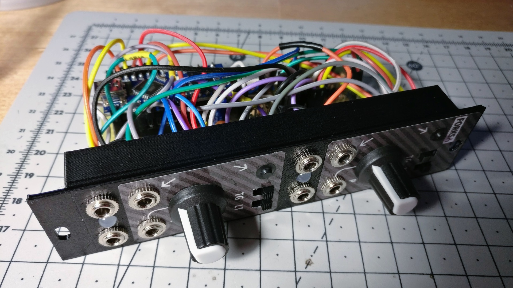

Forks
=====

A DIY Arduino-powered clone of [Mutable Instruments Branches][5], with a couple additional features.

**[Arduino code][1]** | **[BOM][2]** | [🛒 **Buy PCB and panel on Tindie**][3] | **[ModularGrid][6]** | [🗨️ **Mod Wiggler**][4]

[1]: forks.ino
[2]: forks-bom.csv
[3]: https://www.tindie.com/products/joeseggiola/forks-a-diy-clone-of-mi-branches-pcb-panel/
[4]: https://www.modwiggler.com/forum/viewtopic.php?t=216665
[5]: https://mutable-instruments.net/modules/branches/
[6]: https://www.modulargrid.net/e/joeseggiola-forks

Features
--------

- Two Bernoulli gates similar to the ones found in [Mutable Instruments Branches][5]:
    - the **input** signal (trigger or gate) is routed to either of two outputs;
    - the **knob** and **CV input** control the probability of routing the signal to either outputs.
- Manual input button, it can be used as a manual trigger/gate generator.
- Both toggle and latch modes are enabled with two independent dedicated switches:
    - in **toggle** mode, probability is used to decide if sending the signal to the same output as before, or the other;
    - in **latch** mode, an output stays high until the other output gets activated.
- The second channel input is optionally normalized to the first one, using a jumper on the back.

Schematic
---------

Only one Bernoulli gate is laid out, the second is an exact copy.

Pictures
--------

### New [PCB](pcb/) build

[🛒 **Buy PCB and panel on Tindie**][3]

 

### Old [3D-printed](3d/) build

 
