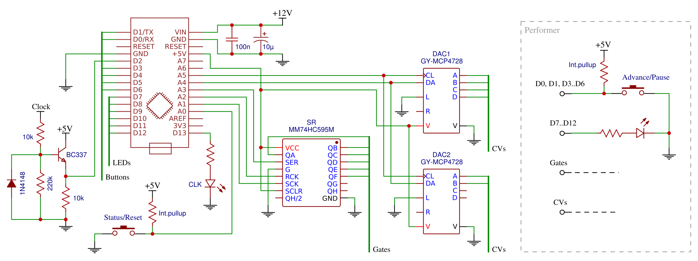
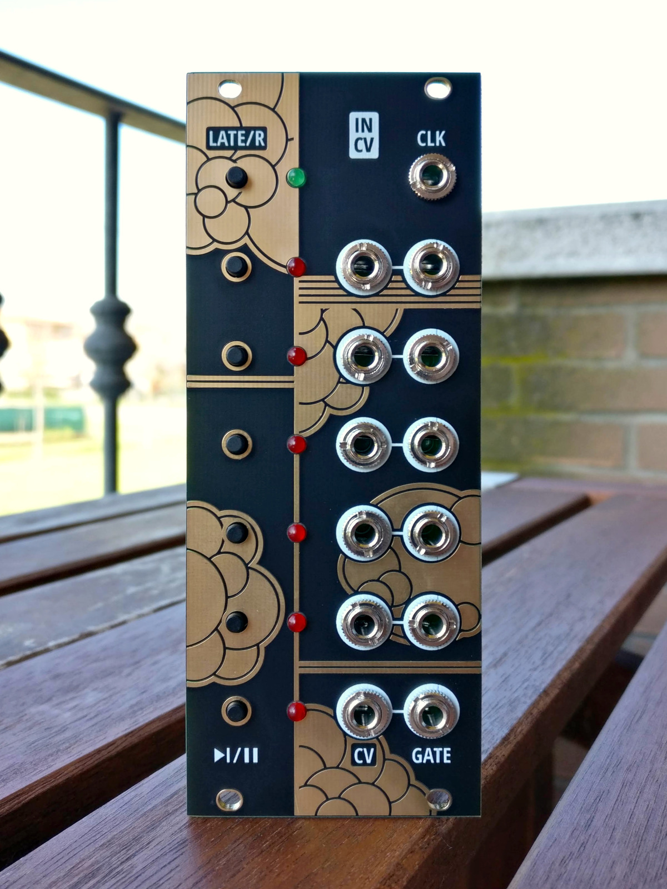
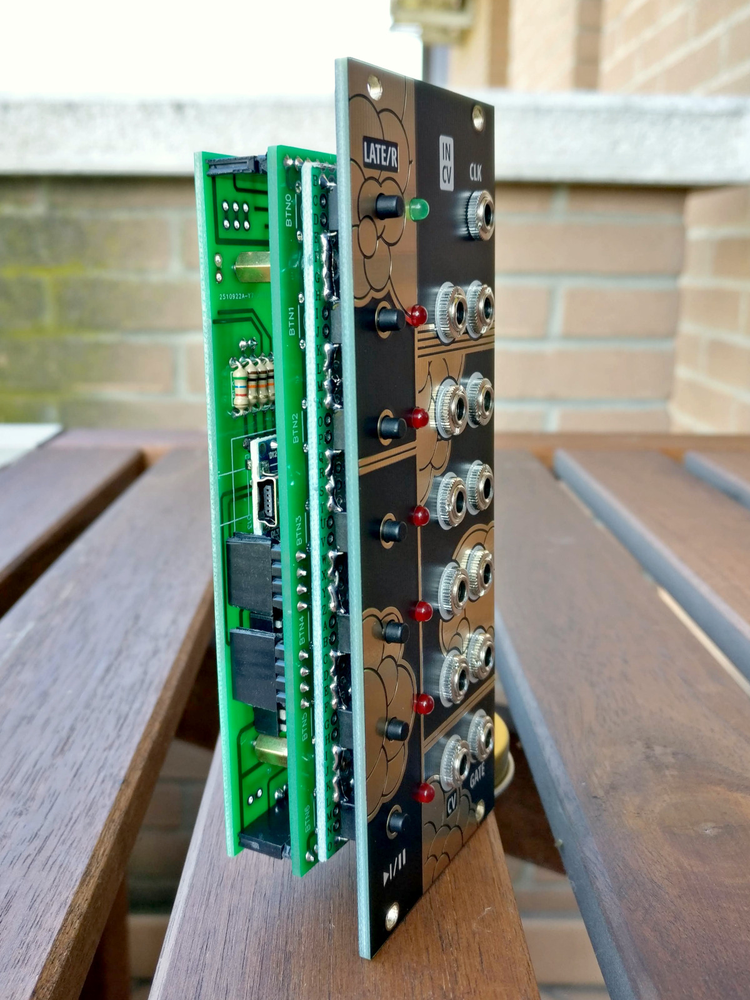
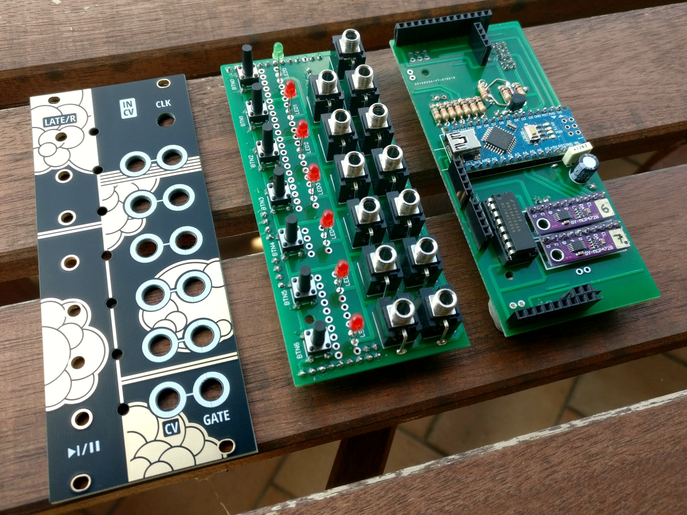
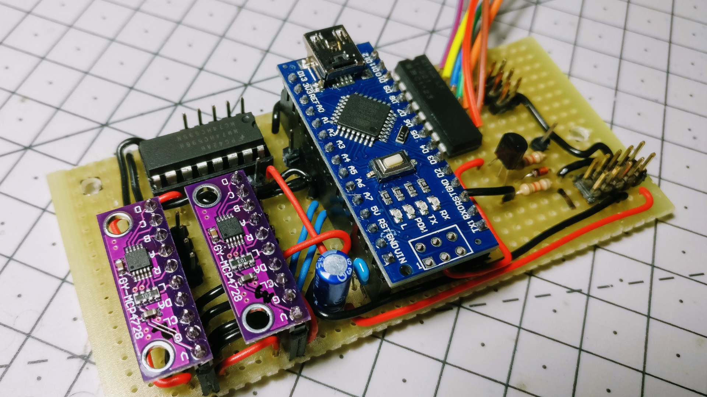
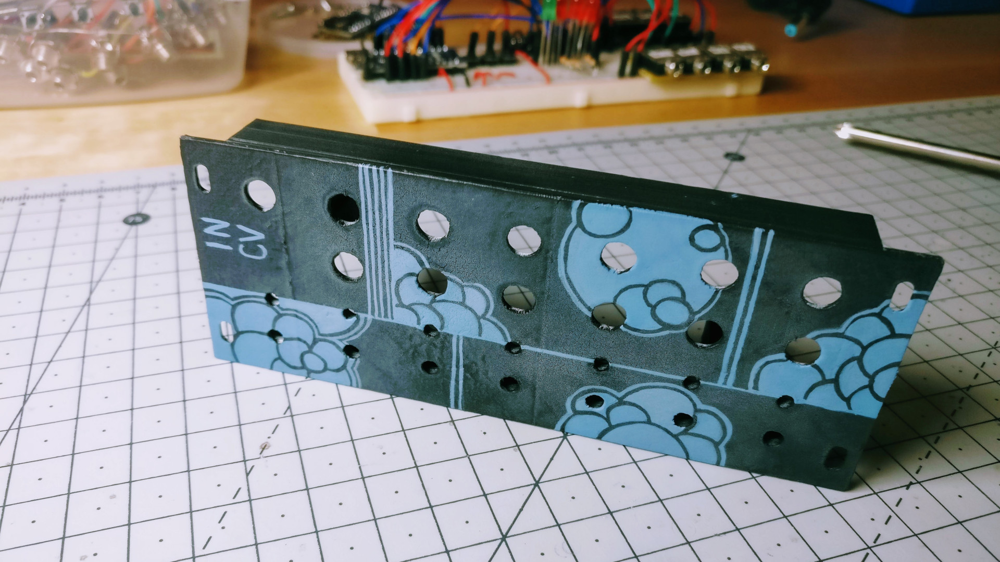
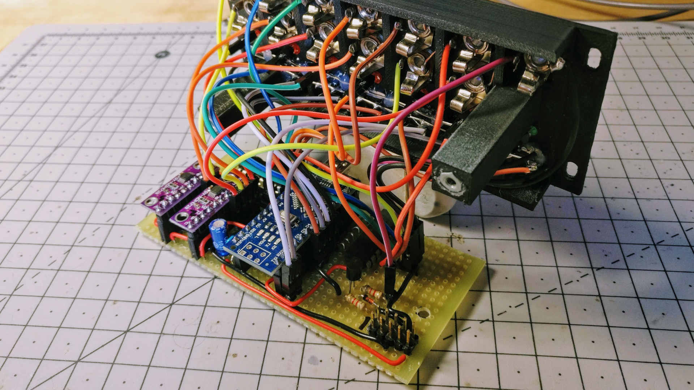
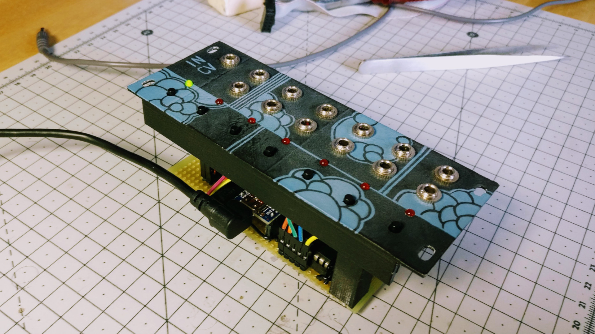

In CV
=====

A DIY Arduino-powered virtual ensemble that plays Terry Riley's "In C" on CV/gate outputs.

**[Arduino code][1]** | **[ModularGrid][7]** | [🛒 **Buy on Tindie**][6] | [🛒 **Buy on Reverb**][5] | **[YouTube demo][3]** | [🗨️ **Mod Wiggler**][4]

[1]: in-cv.ino
[3]: https://youtu.be/ea2zLXFY1C4
[4]: https://modwiggler.com/forum/viewtopic.php?t=227451
[5]: https://reverb.com/item/39927694-in-cv-terry-riley-s-in-c-implementation-for-eurorack
[6]: https://www.tindie.com/products/joeseggiola/in-cv-eurorack-module/
[7]: https://www.modulargrid.net/e/joeseggiola-in-cv

Features
--------

* Six performers that play "In C" patterns on 1V/oct CV/gate outputs.
* Each performer has a button to advance through the 53 patterns, or to pause at the end of the current loop (long-press).
* LEDs show when a note is played, but will start blinking if the performer is left behind by three or more patterns.
* External clock input to control playback speed.
* Main button to show late performers, or to reset everything to initial state (long-press).
* In the initial state every performer plays a steady C with no gate (for tuning), until the advance button is pressed and the first pattern starts being played.

### Patterns data generation

Arduino code reads the definitions of the 53 patterns of "In C" from [`patterns/patterns.h`][20]. This file is not hand-written, but automatically generated using [`patterns/cli.js`][21], a Node.js command line script. This script translates music notation contained in [`patterns/patterns.txt`][22] into performant and memory-efficient data.

That said, you can write your own patterns and sequences to make the module play just about anything. Edit the TXT file (one sequence per line), install [Node.js][23] and then run this in the `patterns/` folder:

	npm install
	npm start -- patterns.txt

[20]: patterns/patterns.h
[21]: patterns/cli.js
[22]: patterns/patterns.txt
[23]: https://nodejs.org/en/

### Calibration procedure

Power on your modular system with the reset button pressed: the reset LED lights up steadily to show you entered the DACs calibration procedure. Performers LEDs show which CV output is currently being calibrated. The procedure requires measuring the output voltage using a multimeter with mV precision (0.001V).

The first CV output should be around 0.5V: use the first performer button to decrease the measured value, or the second one to increase it, until you get exactly 0.500V. Now press the reset button to advance to the next calibration point, that is 1.000V, and adjust the measured value again. There are 8 calibration points for each CV output, after which the calibration process is repeated for the other CV outputs, as shown by performers LEDs.

At the end of the whole procedure, the module will reboot itself and all CV outputs will track 1V/oct accurately. Calibration data is stored in Arduino EEPROM memory, so it's persisted across reboots and won't be lost by uploading new patterns.

Circuit
-------

The following is just a hint for a possible circuit implementation.

Pictures
--------

### New PCB build

[🛒 **Buy on Tindie**][6] | [🛒 **Buy on Reverb**][5]

  

### Old 3D-printed build

   

Thanks
------

- [Tero Parviainen][10]'s [analysis and JavaScript implementation][11] of "In C"

[10]: https://teropa.info/
[11]: https://teropa.info/blog/2017/01/23/terry-rileys-in-c.html
